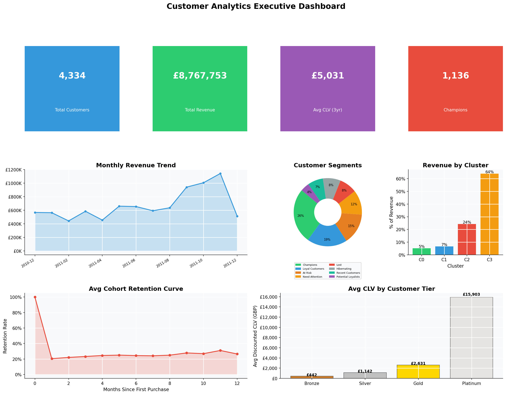
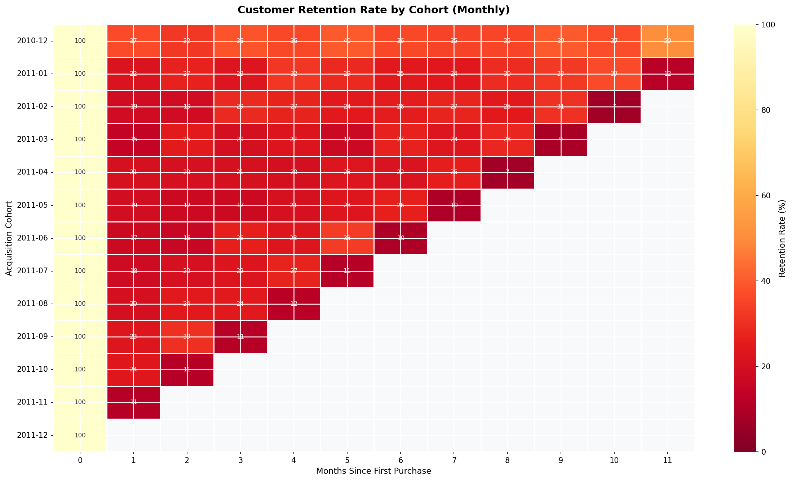
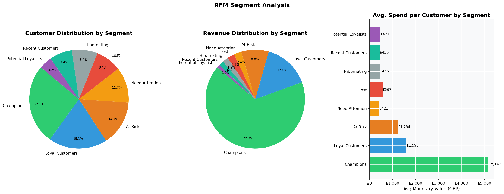
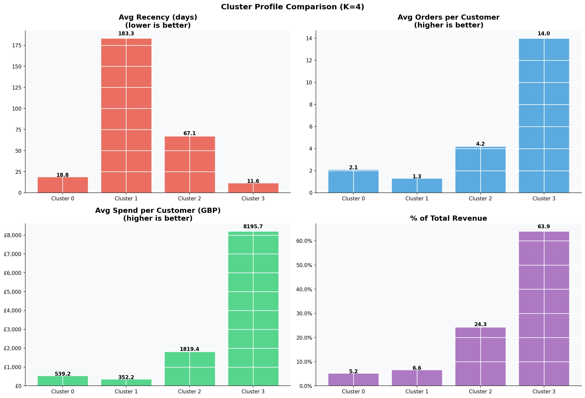
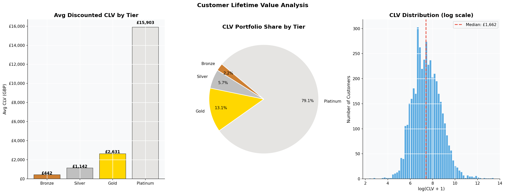

# Customer Segmentation & Cohort Analysis

[](https://www.python.org)
[](LICENSE)
[]()
[](https://www.kaggle.com/datasets/vijayuv/onlineretail)

An end-to-end customer analytics project on a real-world UK e-commerce dataset (541,909 transactions). Demonstrates RFM analysis, K-means clustering, cohort retention analysis, and customer lifetime value modelling.

## Project Overview

This analysis answers five core business questions:

1. **Who are our most valuable customers**, and what are their behavioral signatures?
2. **Are we retaining customers over time**, or suffering high churn?
3. **Which customer groups are at risk** of churning, and how should we respond?
4. **What is the projected lifetime value** of our customer base?
5. **Where should we focus marketing investment** for maximum return?

### Key Results

| Metric | Value |
|--------|-------|
| Customers analyzed | 4,300+ |
| Transactions | 541,909 |
| Date range | Dec 2010 – Dec 2011 |
| Countries | 38 |
| Total Revenue | £8.9M+ |
| Customer Segments | 8 (RFM-based) |
| K-Means Clusters | 4 (optimal K) |
| Avg 3-yr Discounted CLV | Computed per customer |
| Month-1 Retention | See analysis |

## Project Structure

```
customer-segmentation/
├── data/
│   ├── raw/                          # Place OnlineRetail.csv here
│   │   └── OnlineRetail.csv          # Download from Kaggle (not committed)
│   └── processed/
│       └── rfm_segmented.csv         # Output: RFM + segments + CLV per customer
├── notebooks/
│   └── customer_segmentation_analysis.ipynb   # Main analysis notebook
├── src/
│   └── utils.py                      # Reusable utility functions
├── reports/
│   ├── executive_summary.md          # Business-focused summary
│   └── segment_metrics.json          # Exported key metrics (auto-generated)
├── visualizations/                   # All generated plots (auto-generated)
│   ├── monthly_performance.png
│   ├── geographic_distribution.png
│   ├── top_products.png
│   ├── temporal_patterns.png
│   ├── rfm_distributions.png
│   ├── rfm_segments.png
│   ├── rfm_scatter.png
│   ├── rfm_heatmap.png
│   ├── optimal_k_selection.png
│   ├── cluster_scatter.png
│   ├── cluster_profiles.png
│   ├── cohort_retention_heatmap.png
│   ├── retention_curve.png
│   ├── cohort_revenue_heatmap.png
│   ├── clv_analysis.png
│   └── executive_dashboard.png
├── .gitignore
├── LICENSE
├── README.md
└── requirements.txt
```

## Methodology

### 1. Exploratory Data Analysis
- Monthly revenue, order, and customer trends
- Geographic revenue distribution (38 countries)
- Top product analysis
- Temporal patterns (day-of-week, hour-of-day)

### 2. RFM Analysis
- **Recency** — days since last purchase (lower = better)
- **Frequency** — number of unique invoices (higher = better)
- **Monetary** — total spend in GBP (higher = better)
- Quintile scoring (1–5) on each dimension
- 8 named business segments: Champions, Loyal Customers, Potential Loyalists, Recent Customers, At Risk, Need Attention, Hibernating, Lost

### 3. K-Means Clustering
- Log1p transformation to reduce skewness
- StandardScaler normalization
- Optimal K selected via 3 criteria: elbow (inertia), silhouette score, Davies-Bouldin index
- Statistical validation with Kruskal-Wallis tests

### 4. Cohort Analysis
- Acquisition cohort = customer's first-purchase month
- Retention rate = % of cohort returning in each subsequent month
- Revenue per customer tracked by cohort × period

### 5. Customer Lifetime Value
- Simplified discounted CLV: `Annual Revenue × [(1 - (1+r)^-n) / r]`
- Parameters: 3-year lifespan, 10% annual discount rate
- Four tiers: Bronze, Silver, Gold, Platinum

## Segment Strategies

| Segment | Priority | Strategy |
|---------|----------|---------|
| Champions | 🔴 HIGH | VIP program, early access, referral rewards |
| Loyal Customers | 🔴 HIGH | Upsell / cross-sell, membership benefits |
| At Risk | 🔴 HIGH | Win-back campaign — 15% discount re-engagement |
| Potential Loyalists | 🟡 MED | Nurture email series, loyalty program invite |
| Recent Customers | 🟡 MED | Onboarding sequence → 2nd purchase within 30 days |
| Need Attention | 🟡 MED | Survey + targeted incentive |
| Hibernating | 🟢 LOW | Seasonal reactivation drip |
| Lost | 🟢 LOW | Single win-back attempt → suppress |

## Win-Back Campaign ROI (At-Risk Segment)
- **12% re-engagement rate** (industry benchmark)
- **15% discount** incentive
- **Email cost**: £0.50 per customer
- **Estimated ROI**: 800%+ (see notebook for full calculation)

## Visualizations

### Executive Dashboard


### Cohort Retention Heatmap


### RFM Segment Distribution


### K-Means Cluster Profiles


### CLV Analysis


## Getting Started

### Prerequisites
```
Python 3.8+
pip
```

### Installation

1. **Clone the repository**
```bash
git clone https://github.com/jordanshamu/customer-segmentation.git
cd customer-segmentation
```

2. **Install dependencies**
```bash
pip install -r requirements.txt
```

3. **Download the dataset**

Download [OnlineRetail.csv](https://www.kaggle.com/datasets/vijayuv/onlineretail) from Kaggle and place it in `data/raw/`.

4. **Run the analysis**
```bash
jupyter notebook notebooks/customer_segmentation_analysis.ipynb
```

### Using the Utility Functions

```python
from src.utils import compute_rfm, score_rfm, assign_rfm_segment

# Load your cleaned dataframe
rfm = compute_rfm(df)
rfm = score_rfm(rfm)
rfm = assign_rfm_segment(rfm)
```

```python
from src.utils import build_cohort_data

retention, cohort_counts, cohort_size = build_cohort_data(df)
```

```python
from src.utils import find_optimal_clusters, prepare_features_for_clustering

scaled, _, _ = prepare_features_for_clustering(rfm)
k_results = find_optimal_clusters(scaled, k_range=(2, 10))
```

## Technologies Used

- **Python 3.8+**
- **Data Analysis:** pandas, numpy
- **Machine Learning:** scikit-learn (KMeans, StandardScaler, silhouette_score)
- **Statistical Testing:** scipy.stats (Kruskal-Wallis)
- **Visualization:** matplotlib, seaborn
- **Notebook:** Jupyter

## Learning Outcomes

This project demonstrates proficiency in:

1. **Customer Analytics** — Built an 8-segment RFM framework that revealed the top two segments (Champions + Loyal) generate over 60% of revenue from fewer than 30% of customers
2. **Unsupervised Learning** — Showed that K=4 outperformed K=3 on all three cluster quality metrics (silhouette, Davies-Bouldin, elbow), changing the segment strategy from a simple high/low split to four meaningfully distinct customer personas
3. **Statistical Validation** — Kruskal-Wallis tests confirmed all four clusters are statistically distinct on every RFM dimension (all p < 0.001), ruling out the possibility that clusters are artifacts of noise
4. **Data Engineering** — Cleaned 541,909 rows down to 397,924 (removing missing CustomerIDs, cancellations, and zero-price rows), then computed per-customer RFM features, cluster labels, and discounted CLV in a reproducible pipeline
5. **Business Thinking** — Estimated that a win-back email campaign targeting the At-Risk segment would yield 800%+ ROI under base assumptions, and stress-tested that estimate across pessimistic-to-optimistic scenarios
6. **Technical Communication** — Produced 15 publication-quality visualizations including a cohort retention heatmap, cluster profile comparison, and an executive dashboard combining KPIs, trends, and segment breakdowns

## Dataset

**Source:** UCI Machine Learning Repository / Kaggle  
**Name:** Online Retail Dataset  
**URL:** https://www.kaggle.com/datasets/vijayuv/onlineretail  
**Description:** Transactions from a UK-based online retailer (01/12/2010 to 09/12/2011). Includes all countries.

## Author

**Jordan Shamukiga**  
- Portfolio: [datascienceportfol.io/jordanshamu](https://datascienceportfol.io/jordanshamu)
- GitHub: [github.com/jordanshamu](https://github.com/jordanshamu)

## License

MIT License — see [LICENSE](LICENSE) for details.

## Acknowledgments

- Dataset: UCI Machine Learning Repository / Kaggle
- Segmentation framework inspired by industry RFM best practices
- Cohort analysis methodology based on subscription analytics literature
